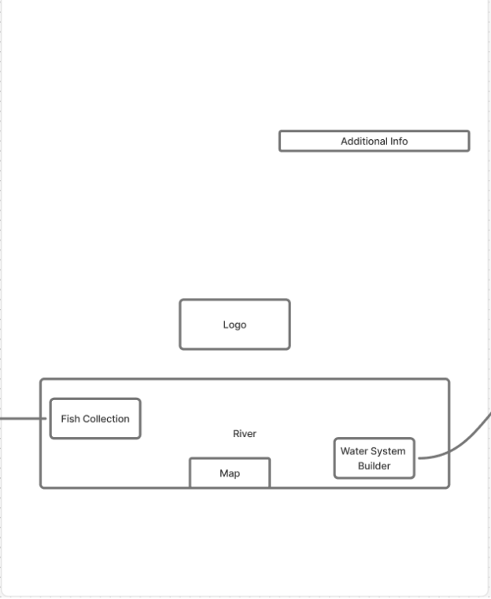
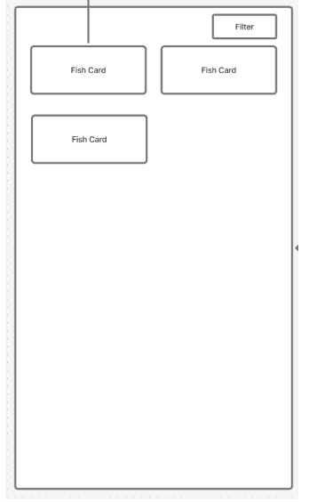
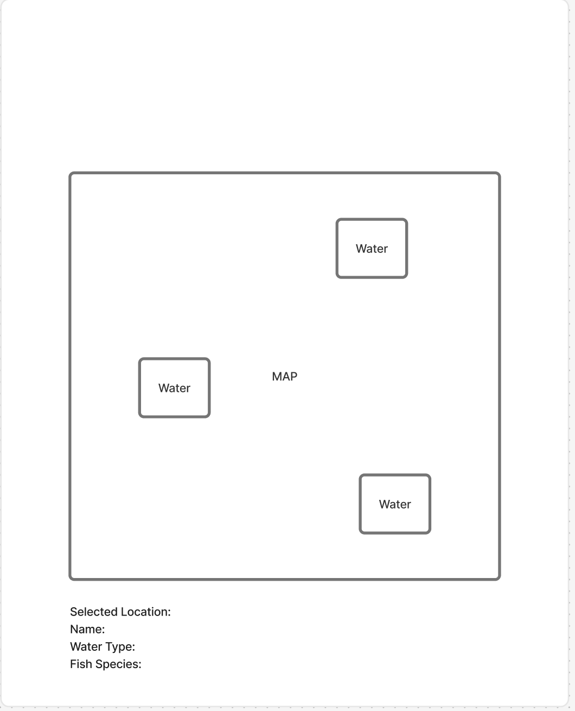

# Fishtech Page Specs

## 1) Landing Page

### Page Title
Landing Page (Welcome)

### Page Description
**Purpose:** To introduce Fishtech and allow users to explore the application. The main landing page will highlight key features such as searching for fish species, building a fish habitat, and viewing an interactive map.

**Mockup:**


### Parameters Needed for the Page
- Query params: none
- Route params: none

### Data Needed to Render the Page
- Static content: headline, art, feature descriptions
- Auth state: logged in / not logged in (for nav links)

### Link Destinations for the Page
- `/` — main page
- `/gallery` — gallery of fishes
- `/build` — build a water system
- `/login` — login page
- `/signup` — sign up page
- `/map` — interactive map

### Tests for Verifying Rendering of the Page
1. **Static content renders**
   - Headline, art, and feature descriptions are visible
2. **Link destinations render**
   - Each nav link is present, and clicking it navigates correctly
3. **Auth-aware nav state**
   - Logged out: `/login` and `/signup` are visible
   - Logged in: `/login` and `/signup` are no longer visible

---

## 2) Login Page

### Page Description
**Purpose:** A login page that allows users to log in and unlock additional features.

**Mockup:**
```
+---------------------------------------------+
| Fishtech                    Log In          |
|---------------------------------------------|
| Email:    [____________________]            |
| Password: [____________________]            |
|                                             |
|              [ Log In ]                     |
|---------------------------------------------|
|             Create account                  |
+---------------------------------------------+
```

### Parameters Needed for the Page
- Query params: none
- Route params: none

### Data Needed to Render the Page
- UI state: email, password, validation errors, loading state
- API: auth endpoint response
- Auth state storage: token persistence and in-memory auth context

### Link Destinations for the Page
- `/` — home page
- `/signup` — create an account

### Tests for Verifying Rendering of the Page
1. **Form elements render**
   - Email, password, and Log In button are visible
2. **Validation**
   - Invalid input shows errors
3. **Auth success flow**
   - Successful login stores token and navigates to `/`
4. **Auth failure flow**
   - Shows an error message

---

## 3) Fish Details

### Page Description
**Purpose:** To search and display detailed information about fish species, including habitats and water conditions.

**Mockup:**


### Parameters Needed for the Page
- Route params: none
- Query params:
  - `?search=fishName`
  - `?waterType=`
  - `?habitat=`

### Data Needed to Render the Page
- UI state: search text, selected fish, search results
- API: list of fish species, information on fishes

### Link Destinations for the Page
- `/` — main page
- `/build` — habitat builder
- `/map` — interactive map

### Tests for Verifying Rendering of the Page
1. **Search interface**
   - Search bar and search button are visible
2. **Display search results**
   - Matching results shown for search query
3. **Fish details display**
   - Selecting a fish shows its name, image, habitat information, and other details
4. **No results**
   - If no fish matches the search, a "No fish found" message appears
5. **Navigation**
   - Links back to the landing page, habitat builder, login page, and interactive map

---

## 4) Habitat Builder

### Page Description
**Purpose:** An interactive tool that allows the user to build their own water system with fish and matches it to an existing water system if possible.

**Mockup:**


### Parameters Needed for the Page
- Query params:
  - `?search=fishName`
  - `?waterType=`
  - `?habitat=`

### Data Needed to Render the Page
- UI state: search text, selected fish, search results, water system parameters
- API: list of fish species filtered by compatibility, list of known similar water systems

### Link Destinations for the Page
- `/` — home page

### Tests for Verifying Rendering of the Page
1. **Search renders and filters**
   - Search input is visible; typing filters and returns matching fish names
2. **Fish selection updates state**
   - Selecting a fish adds it to the habitat
3. **Water system matching**
   - Given a combination of fish/water, an existing water system is matched by percentage
4. **Save behavior**
   - If logged in, habitat data is saved and success is confirmed

---

## 5) Interactive Map

### Page Description
**Purpose:** To view different habitats on an interactive map. Users can select a river on the map and view the species of fish living there along with their water conditions.

**Mockup:**


### Parameters Needed for the Page
- Route params: none
- Query params:
  - `?location=waterBody`

### Data Needed to Render the Page
- UI state: map view, selected location
- API: lists of lakes, rivers, and streams; fish species per location; water information per location

### Link Destinations for the Page
- `/` — main page
- `/build` — habitat builder
- `/search` — fish search

### Tests for Verifying Rendering of the Page
1. **Map**
   - Interactive map is visible, limited to Colorado
2. **Location selection**
   - Clicking on a location displays information
3. **Fish information display**
   - Displays fish inhabiting the selected body of water
4. **Habitat information display**
   - Displays habitat information
5. **No location selected**
   - If there is no valid location, a "No location found" message appears
6. **Navigation**
   - Links back to the landing page, habitat builder, login page, and interactive map
