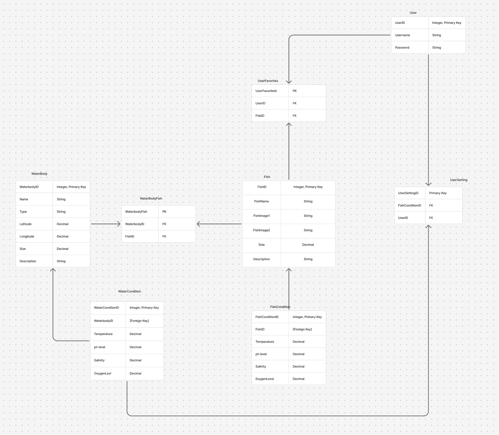

\# SQL\_TESTING.md  
\#\# Project Milestone 5: SQL Design  
\*\*Project:\*\* FishTech  
\*\*Purpose:\*\* Database design and testing specification for developers  

\---  
\#\# Overview  
This document describes the \*\*database schema\*\*, \*\*table relationships\*\*, and  
\*\*data access methods\*\* for the FishTech application. It is intended as a  
\*\*developer-facing design document\*\* that clearly defines how data is stored,  
accessed, and validated.

This document answers the following questions:  
\- What tables exist in the database?  
\- What fields and constraints do those tables contain?  
\- How are tables related?  
\- What data access methods are required?  
\- Which pages depend on which data?  
\- How do we test both the schema and the access routines?

\---  
\# Database Tables  
At minimum, the system requires the following tables:  
\- \`fish\`  
\- \`WaterBody\`  
\- \`FishPreferredConditions\`  
\- \`WaterConditions\`  
\- \`Users\`

Each table is described below.  
\---  
\#\# 1\) Table: Fish  
\#\#\# Table Description  
Stores the different kinds of fish species, descriptions, and images  
\#\#\# Fields  
| Field Name | Description | Constraints |  
|----------|------------|-------------|  
| FishID | Unique fish identifier | Primary key |  
| FishName | Unique fish name| NOT NULL |  
| FishImage1 | Image 1 of fish| n/a |  
| FishImage2 | Image 2 of fish | n/a |  
| Size| Average size description| Decimal |  
| Description| Fish Description | NOT NULL|

\#\#\# Relationships  
\- One-to-many with \`FishPreferredWaterConditions\`  
\- One fish can have one or more preferred water condition record.

\#\#\# Table Tests  
\*\*Use Case Name:\*\* Create Fish record  
\*\*Description:\*\* Verify that a new Fish record can be stored within the database  
\*\*Pre-conditions:\*\* Database running and Fish Table exists  
\*\*Test Steps:\*\*  
1\. Insert a fish with a valid name, image path, size, and description.   
2\. Query the new fish using FishID.

\*\*Expected Result:\*\* The Fish is recorded   
\*\*Actual Result:\*\*   
\*\*Status:\*\* Pass  
\*\*Post-conditions:\*\* The fish remains stored in the database

\---  
\#\# 2\) Table: WaterBody  
\#\#\# Table Description  
Stores basic information about each water body, including its name, location, size, and type.   
\#\#\# Fields  
| Field Name | Description | Constraints |  
|----------|------------|-------------|  
| WaterbodyID | Unique water body identifier | Primary key |  
| Name | Waterbody Name | NOT NULL |  
| Latitude | Latitude Coordinate | NOT NULL |  
| Longitude | Longitude Coordinate | NOT NULL |  
| Size | WaterbodySize in (?) units | NOT NULL |  
| Type | Type of water body (lake, river, resevoir) | NOT NULL |  
| Description | Additional Information |  Optional  |  
\#\#\# Relationships  
\- One-to-One with \`WaterConditions\`  
\#\#\# Table Tests  
\*\*Use Case Name:\*\* Find water bodies that match fish preference  
\*\*Description:\*\* Display water bodies whose environmental conditions match the preferred habitat of a selected fish  
\*\*Pre-conditions:\*\* The database contains fish preference data, waterbody data, and water conditions data. User has selected a fish  
\*\*Test Steps:\*\*  
1\. On the page for selecting fish to find waterbodies  
2\. Select a fish species  
3\. Select search button  
4\. See water body results  
\*\*Expected Result:\*\* Correct water bodies that match fish preference is selected and displayed  
\*\*Actual Result:\*\*  
\*\*Status:\*\*   
\---  
\#\# 3\) Table: FishPreferredConditions  
\#\#\# Table Description  
Stores the preferred water condition habitat for all fish species. This table will be used with the habitat builder to compare user-selected habitat conditions.  
\#\#\# Fields  
| Field Name | Description | Constraints |  
|----------|------------|-------------|  
| ConditionID | Unique ConditionID for preferred water conditions| Primary Key |  
| FishID | Fish associated with water conditions | Foreign key → Fish.FishID, NOT NULL |  
| Temperature | Preferred water temp for fish| Decimal, NOT NULL|  
| ph\_level | Preferred ph level for fish| Decimal, NOT NULL |  
| Salinity | Preferred Salinity for fish | Decimal, NOT NULL |  
| OxygenLevel | Preferred Oxygen level for fish | Decimal, NOT NULL |

\#\#\# Relationships  
\- One-to-one with fish   
\- Each fish belongs to one preferred water condition record

\#\#\# Table Tests  
\*\*Use Case Name:\*\* Store preferred fish conditions   
\*\*Description:\*\* Verify that a valid preferred condition can be stored with an existing fish

\*\*Test Steps:\*\*  
1\. Insert preferred condition values using a valid FishID  
2\. Query the table using the same FishID  
\*\*Expected Result:\*\* Preferred condition is returned  
\*\*Status:\*\* Pass  
\*\*Post-conditions:\*\* The preferred condition remains stored in the database

\#\# 4\) Table: WaterConditions  
\#\#\# Table Description  
Stores the preferred water condition habitat for all fish species. This table will be used with the habitat builder to compare user-selected habitat conditions.  
\#\#\# Fields  
| Field Name | Description | Constraints |  
|----------|------------|-------------|  
| ConditionID | Unique ConditionID for preferred water conditions| Primary Key |  
| WaterBodyID | Bodies of water associated with this condition || Foreign key → Fish.FishID, NOT NULL |  
| Temperature | Water temperature| Decimal, NOT NULL|  
| ph\_level | ph\_level of Water| Decimal, NOT NULL |  
| Salinity |Salinity | Decimal, NOT NULL |  
| OxygenLevel | Oxygen level| Decimal, NOT NULL |

\#\#\# Relationships  
\- One-to-One relationships with WaterBody  
\- Each condition can be associated with one body of water

\#\#\# Table Tests  
\*\*Use Case Name:\*\* Store water conditions   
\*\*Description:\*\* Verify that a valid condition can be stored

\*\*Test Steps:\*\*  
1\. Insert condition values using a valid WaterConditionID  
2\. Query the table using the same WaterConditionID  
\*\*Expected Result:\*\* Preferred condition is returned  
\*\*Status:\*\* Pass  
\*\*Post-conditions:\*\* The preferred condition remains stored in the database

\---  
\#\# 5\) Table: User  
\#\#\# Table Description  
Stores users' accounts as well and settings  
\#\#\# Fields  
| Field Name | Description | Constraints |  
|----------|------------|-------------|  
| UserID | Unique user identifier | Primary key |  
| username | username | Unique, NOT NULL |  
| password | Hashed password | NOT NULL |

\#\#\# Relationships

\- Many-to-many with \`FishTable\` through \`favoritefish\`  
\- Many-to-many with ‘WaterCondition’ through ‘usersConfig’ 

\#\#\# Table Tests  
\*\*Use Case Name:\*\* Create user record  
\*\*Description:\*\* Verify that a new user can be stored  
\*\*Pre-conditions:\*\* Database running  
\*\*Test Steps:\*\*  
1\. Insert valid user row  
2\. Query by userName  
\*\*Expected Result:\*\* User row exists  
\*\*Actual Result:\*\* User returned by query  
\*\*Status:\*\* Pass  
\*\*Post-conditions:\*\* User persisted

\*\*Use Case Name:\*\* Verify users setting  
\*\*Description:\*\* Verify that users can reassess past creations  
\*\*Pre-conditions:\*\* Database running, water system has been made  
\*\*Test Steps:\*\*  
 Query WaterConditionId and UserID junction table using the userID to verify settings  
\*\*Expected Result:\*\* userSettingID exists   
\*\*Actual Result:\*\* WaterConditionID is returned, allowing users to remake the water system.  
\*\*Status:\*\* Pass  
\*\*Post-conditions:\*\* User persisted  
\---  
\# Data Access Methods  
Each table has at least one access method.  
\---  
\#\# Access Method: getAllFish()  
\#\#\# Description  
Fetches all fish in the database.  
\#\#\# Parameters  
\- none  
\#\#\# Return Values  
\- A list of all fish records  
\#\#\# Tests  
\*\*Use Case Name:\*\* Retrieve all fish  
\*\*Pre-conditions:\*\* Fish record exists  
\*\*Test Steps:\*\*  
1\. Call getAllFish()  
\*\*Expected Result:\*\* All fish records return  
\*\*Post-conditions:\*\* None  
\---  
\#\# Access Method: get\_favorited\_fish  
\#\#\# Description  
Returns all fish that has a user favorited it  
\#\#\# Parameters  
\- fish\_id  
\#\#\# Return Values  
\- List of fish\_id  
\#\#\# Tests  
1\. Fish with favorites get returned  
2\. Fish with no favorites are not getting returned  
\---  
\#\# Access Method: get\_waterbodies\_for\_fish  
\#\#\# Description  
Returns water bodies whose environmental conditions match the preferred conditions of a selected fish  
\#\#\# Parameters  
\- fish\_id (int)  
\#\#\# Return Values  
\- List of matching waterbodies  
\#\#\# Tests  
1\. Fish with matching habitats returns one or more water bodies  
2\. Fish with no matching habitat conditions returns an empty list.   
\---  
\#\# Access Method: get\_user\_by\_username  
\#\#\# Description  
Retrieves a user record using the username for authentication  
\#\#\# Parameters  
\- username (string)  
\#\#\# Return Values  
\- User record/object  
\#\#\# Tests  
1\. A user with an existing username returns the correct user record.   
2\. A user with a non-existing username returns null.   
\---  
\# Page-to-Database Mapping  
| Page | Tables Accessed |  
|----|----------------|  
| Login | users |  
| Landing Page | Fish, WaterBody |  
| Fish search page | Fish |  
| Fish details page | Fish, FishPreferredConditions |  
| Habitat Builder Page| Fish, FishPreferredConditions |  
| Interactive map page | WaterBody, WaterConditions |  
| Water bodies for fish page | Fish, FishPreferredConditions, WaterBody, WaterConditions|  
\---  
\# Page Data Access Tests  
\*\*Use Case Name:\*\* Finding matching bodies of water for fish  
\*\*Description:\*\* Verify that the application matches bodies of water that meet condition requirements for the selected fish   
\*\*Pre-conditions:\*\* Fish, WaterConditions, WaterBody, and FishPreferredConditions exist.   
\*\*Test Steps:\*\*  
1\. Open fish details page  
2\. Select a fish species  
3\. Call get\_waterbodies\_for\_fish() using FishID  
4\. Display the returned bodies of water  
\*\*Expected Result:\*\* Correct data displayed, only matching habitat conditions to fish are displayed  
\*\*Post-conditions:\*\* None

